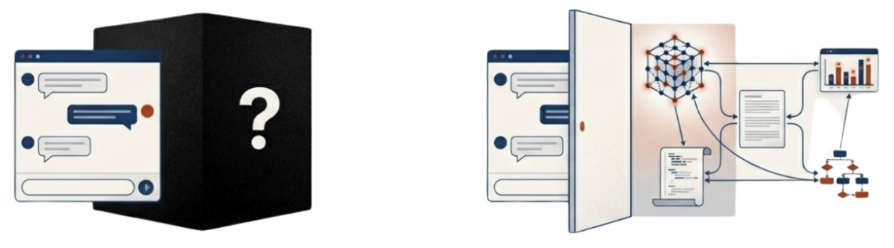
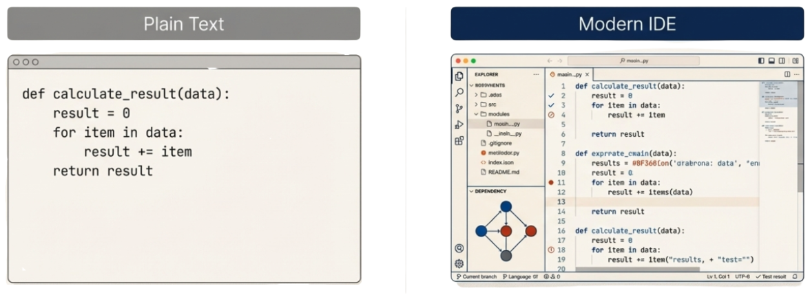
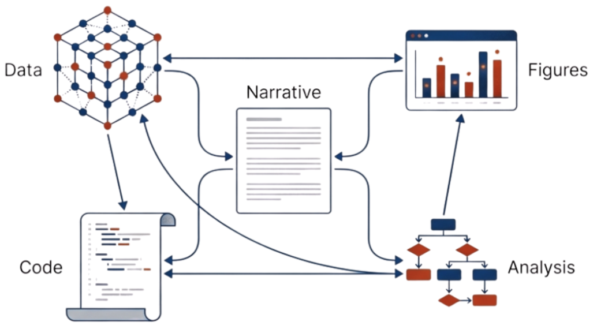

Language models can parse PDFs, extract figures from images, summarize papers, infer missing metadata, and answer questions about almost any format. When a growing share of scientific interaction takes place through chat interfaces, it’s tempting to imagine a future where structure doesn’t matter—where AI simply interprets the mess for us.

**If AI can read _anything_, do we still need standards?**

This framing misses something fundamental.
**Standards don’t just shape machines. They shape people.**
They structure how research is expressed, how it is reviewed, how it is rewarded, and ultimately what gets made. When standards encode good practices, they turn values into defaults—so that simply participating in the system means adhering to those practices[^practices].

[^practices]: Good practices in science—such as data sharing, reproducibility, transparency, and reuse—do not spread by agreement alone; they spread when they are built into the structures of how research is done and shared. Standards can encode these practices directly, making them part of the normal workflow rather than optional extras. A well-known example is the FAIR principles, which formalized expectations around data being Findable, Accessible, Interoperable, and Reusable. While FAIR is not a single technical format, it has materially reshaped infrastructure, funding requirements, repository design, and community norms by defining what “good” looks like and allowing tools and policies to align around it. In this way, standards operate as cultural infrastructure: they align incentives, tooling, and behavior by making best practices the path of least resistance.

**The interface we offer to the world determines the science the world produces.**

AI changes _how_ we interact with scientific knowledge, but it does not directly change the social forces that govern it. It does gives us a new chance to reshape those forces—**if we build the right substrate underneath.**

## The Interfaces We Create Determine the Incentives We Reinforce

Researchers don’t publish static PDFs because they love them.
They publish PDFs because they are the _interface_ the system expects—and because the incentives, credit structures, and evaluation mechanisms are designed around them.

A paper doesn’t include code because the interface of “the paper” was never designed to hold it.
A multi-panel figure is designed for print because print is intertwined with the incentive models.
Supplementary materials exist on the margins because the format put them there.

> UX creates norms. Norms create incentives. Incentives create behavior.

If our scientific interfaces only allow narrative, we will continue producing narrative-first science.
If they make data second-class, data will remain second-class.
If they hide computation, computation will remain invisible.

AI chat interfaces do not solve these problem.
They sit _on top_ of it.

Without standards, AI simply learns to imitate the old incentives more efficiently. If the ground truth remains a PDF-shaped artifact, AI will produce a PDF-shaped scientific culture—just accessed or created via a chatbot. See, for example, OpenAI's Prism[^prism]. If citations are designed for paper, we will continue to produce things that _look_ like citations but risk fabrication (or worse[^citations]).

[^prism]: Tools such as [OpenAI’s Prism](https://prism.openai.com/), released in January 2026, demonstrate how AI can dramatically lower the friction of producing polished, narrative scientific documents. While this is powerful, it also foregrounds narrative and print-documents as the primary unit of scientific output and de-emphasizes structured data, computation, and verifiable links to underlying research objects. This shift is already increasing strain: AI-assisted submissions and paper-mills exploit narrative-first interfaces to generate content that **looks** scientific while bypassing many of the checks that historically constrained scale. What was once possible but costly is now easy, marketed, supported by dedicated tooling, and subsidized at scale.

[^citations]: Several AI writing tools now include features such as “add the references,” producing reference text or BibTeX citation blocks that compile cleanly into PDFs but may lack DOIs, resolvable identifiers, or any connection to real scholarly records. The result is a document that looks correct but may contain fabricated or unverifiable references—a failure mode already observed in high-profile contexts, including [government reports](https://www.science.org/content/article/trump-officials-downplay-fake-citations-high-profile-report-children-s-health) and [legal filings](https://www.cbsnews.com/news/lawyer-apologizes-ai-fake-quotes-judgments-murder-case-australia/).

Formatless science is not a revolution. It is varnish.

To change the _culture_ of science, we must change the _interfaces_ of science—and interfaces are built on standards[^standards].

[^standards]: Throughout this piece, “standards” need not imply a single, universal specification or a top-down committee process. In practice, standards often begin locally: within a research group, a company, a tool, or even a single application API. What matters is not universality at the outset, but consistency and reuse. As these shared data structures, schemas, and interfaces are adopted more widely—across teams, tools, repositories, or entire segments of open-access science—their value compounds. Capabilities improve, interoperability emerges, tooling stabilizes, and new forms of reuse and attribution become possible, including citation and credit at the level of individual figures, datasets, analyses, or workflows. Standards scale socially as much as technically.

## Standards Are Levers for Social Change, Not Just Technical Scaffolding

When we introduce a new standard for research components—one that defines datasets, analyses, figures, code, protocols, and narrative as _first-class, modular, referenceable objects_—we create:

New Forms Of Credit
: When data, code, figures, or workflows can be cited independently, the system begins to reward those contributions.

New Pathways For Recognition
: Early-career researchers who build tools, notebooks, analyses, or reusable components gain visibility beyond traditional authorship.

New Expectations For Transparency
: When interactive figures or executable notebooks are supported natively, they stop being exceptions and become norms.

New Incentives For Better Science
: If reproducible bundles become the default, reproducibility becomes achievable—not aspirational.

New UX That Reshapes Behavior
: When researchers _see_ modular, computational objects, they begin to _produce_ modular, computational objects.

Social change follows interface change.

And interface change follows standards.

## Chat Is Not Enough

Conversational interfaces are invaluable and completely transformative. They improve accessibility, lower barriers to entry, and empower researchers to interrogate the literature with unprecedented ease.

But chat is not a neutral interface.
It is a **view**, not a **structure**.

Chat hides complexity. \
Chat summarizes. \
Chat smooths over gaps.

Chat does not:

- expose provenance
- ensure or encourage reproducibility
- offer structured credit
- provide version guarantees
- power interactive data exploration
- reflect the modularity of modern research
- surface computational steps or experimental protocols
- enable multi-agent validation or analysis

Without standards, chat becomes a universal UI sitting on top of a fractured, inconsistent, ambiguous world. Science cannot rest on answers that change from run to run.
The scientific record must be inspectable, referenceable, and stable—**not probabilistic**[^probabilistic].

[^probabilistic]: In AI systems, “probabilistic” refers to outputs that are generated based on likelihood rather than fixed rules. Given the same input, a model may produce different responses across runs, shaped by model parameters, sampling strategies, context windows, and training data. This contrasts with deterministic systems, where the same inputs reliably produce the same outputs: an essential property for reproducibility, verification, citation, and long-term integrity of the scientific record.

With standards, chat becomes a **gateway** into a rich ecosystem of modular, interoperable, trustworthy, reusable scientific components.

## AI Agents Make Standards Socially Essential

The next decade will depend not just on single LLMs but ecosystems of AI agents that:

- analyze figures
- validate protocols
- compare results
- run computations
- audit statistical methods
- check materials against RRIDs
- link data to results
- recommend related work
- construct experimental timelines
- verify provenance
- assist in reviewing and curation

Agents amplify incentives. \
They reinforce the patterns available to them. \
They can accelerate good norms—or ossify bad ones.

Agents cannot collaborate reliably without shared standards[^agents].
And when agents become part of the scientific workflow, **the standards we choose will determine the social shape of science.**

[^agents]: Agent collaboration will rely on a hybrid stack: structured content, well-defined APIs, and AI-mediated access patterns such as RAG pipelines, MCP-style servers, or their successors. While the interfaces may evolve, the underlying requirement remains constant: agents need shared, machine-actionable representations of scientific objects to coordinate, reason, verify results, and build on each other’s work.

## Science Needs "IDEs"

A useful comparison comes from evolving tooling and products in software development, from simple text-editors, to Integrated Development Environments (IDEs), to AI-assisted or automated development and vibe-coding.

Modern programming happens in sophisticated environments like [VS Code](https://en.wikipedia.org/wiki/Visual_Studio_Code) and [Cursor](<https://en.wikipedia.org/wiki/Cursor_(code_editor)>) that now integrate AI directly into the interface, alongside language server protocols, linting, static analysis, automated testing, dependency graphs, and version control. Even when these interfaces are completely abstracted away (e.g. [Lovable](<https://en.wikipedia.org/wiki/Lovable_(company)>), [V0](https://en.wikipedia.org/wiki/Vercel)), the foundational technologies still power the experience. These programming tools predate modern LLMs, yet they are precisely what made AI-assisted coding powerful rather than fragile demo-ware.

> AI did not replace these environments. It amplified them. It abstracted them.

Those interfaces work because they operate on **rich context**:

- structured source code
- explicit project boundaries
- dependency graphs and build systems
- externalized as well as bundled resources
- typed languages and schemas
- tests, linters, and automated checks
- sophisticated version control systems
- long-lived, machine-readable artifacts

If we had jumped directly from [Windows Notepad](https://en.wikipedia.org/wiki/Windows_Notepad) to chat‑based code generation—skipping IDEs, compilers, and tooling—the result would have been very different. Stunted. AI systems would lack the structural context and automated corrections they rely on. They would be far more error‑prone, and would be incapable of supporting the industries that now depend on them.

Today, scientific AI is being asked to reason over PDFs and create facsimiles of pieces-of-paper. That is the equivalent of trying to build modern software tooling on plain-text files alone. Tools like OpenAI’s Prism make this tension especially clear: they dramatically improve the experience of producing polished, paper-shaped documents, but they do so by **doubling down on the PDF** as the primary artifact—optimizing for narrative output rather than structured, machine-actionable scientific objects.

PDFs are not a stable foundation. PDFs are not an appropriate medium for knowledge. They erase structure, hide context, and collapse rich computational work into artifacts shaped by print-era incentives. Worse, they constrain what researchers share in the first place: if the unit of evaluation must fit inside a PDF-shaped box, then the incentives for sharing data, code, workflows, and intermediate results are marginalized[^margins].

[^margins]: That is, they are _literally_ in the margins and footers of scientific repositories and our leading journals.

## Adding Context to Research Objects

To build genuinely transformative scientific interfaces, we need standards that treat research outputs as modular _components_ rather than a static opaque document.

That means first-class access to:

- underlying data
- executable analyses and notebooks
- example visualizations
- computational environments
- intermediate results
- provenance and lineage
- modular components that can be reused and recombined

With this context, entirely new experiences become possible: running new analyses directly on prior work, exploring alternative visualizations, launching agents to test hypotheses, or comparing methods across studies without starting from scratch.

This is what will actually transform science—not hallucinated LaTeX rendered in a chat window[^prism], but the _science itself_, connected to the data, code, experiments, and decisions that produced it.

We need standards that work for humans as well as for an AI-mediated future. The good news is that the _translations_ into a new format is now abundantly possible; _the tools exist today_. Future submission or creation interfaces will focus on improving the capture of metadata _at the time of submission/creation_ with human-in-the-loop review; and AI-enabled systems will make this much less painful than todays scientific submission forms.

## Inevitability

No matter the interface, articles will not be parsed or interpreted purely on demand[^structure]. At the scale of hundreds of thousands—or millions—of articles, content must be processed in batches, normalized, and stored in intermediate representations that exist beneath the surface. Search, discovery, recommendation, analytics, monitoring, compliance, and AI-assisted tooling all depend on this step. Real systems cannot afford to re-infer structure from PDFs every time a question is asked.

[^structure]: When tools like ChatGPT or NotebookLM appear to be “reading” a document, they are not interpreting it live each time a question is asked. The document is first ingested: text is extracted, segmented, embedded, and often transformed into intermediate representations such as chunks, vectors, summaries, or structured metadata. These representations are then stored and reused for subsequent queries. This preprocessing step is essential for performance, cost, and scale, and it effectively creates a persistent structure beneath the conversational interface—even when that structure is invisible to the user.

That underlying structure is already being built. Large publishers, repositories, and platforms are actively extracting and maintaining internal representations of articles, figures, citations, entities, and relationships. The ability to understand structure and connections at scale is what enables new products, new services, and—inevitably—new paywalls. This is a major source of excitement across the publishing industry: structure unlocks leverage.

The question, then, is not whether these _data-structures_ will exist. They will.

The real question is whether those data-structures are good—whether they are open standards or proprietary moats, interoperable or siloed; whether they enable new capabilities broadly or concentrate them narrowly; whether they reinforce the incentives we want as a community or quietly entrench the ones we are trying to move beyond; and whether they reflect the values we hold for science as a public, cumulative, and verifiable endeavor.

Data-structures are inevitable infrastructure. What remains undecided is who they serve—if they will be defined by open-standards—and what kind of scientific future they make possible.

## Our Choice

AI gives us the chance to break free from legacy constraints—print-era formats, PDF-centric workflows, incentive systems that reward narrative over substance, and siloed artifacts that undermine reproducibility.

But we only get that future if we define:

- what scientific objects _are_
- how they link together
- how they are reused, remixed, and composed
- how they are cited
- how they are versioned
- how they are validated
- how they surface in tools
- how they appear in chat interfaces
- how agents operate on them

**These are not _just_ technical questions.** \
**They are _social_ ones.**

The standards we build now will shape what scientists create for decades to come.

## The Social Shape of Science

AI makes standards the _primary instrument of social and cultural transformation_ in science.

If we want to move beyond static papers, beyond non-executable figures, beyond buried supplements, beyond ambiguous provenance, and beyond incentive structures rooted in print culture, we need standards that support the science we hope to see.

AI lets us hide complexity from authors and readers. \
Standards let us transform the ecosystem around them. \
_Together_, they allow us to redesign the incentives, workflows, and UX of scientific communication.

This is the work of the [Open Exchange Architecture](https://oxa.dev):
to build the shared substrate that supports richer interfaces, better incentives, more transparent research, and a scientific culture aligned with what we value—not just what we inherited.

The future is not formatless. \
The future is modular, structured, referenceable, computational, composable—and _socially_ transformative.

## Acknowledgements

Thank you to Tracy Teal (openRxiv) and Courtney Babott (CSF, Wildly Open) for their feedback, improvements, and for the many conversations that shaped these ideas.
